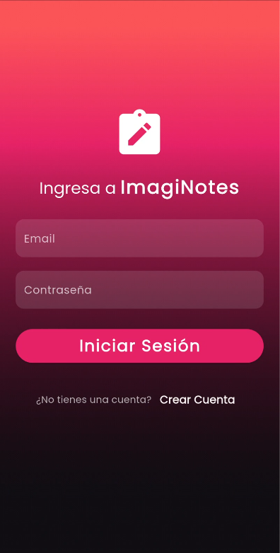
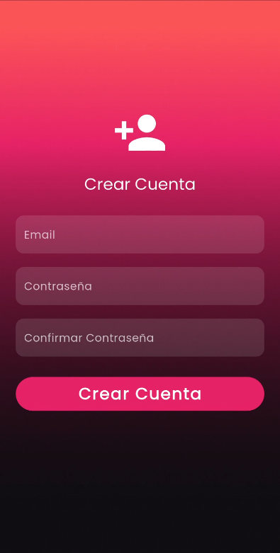
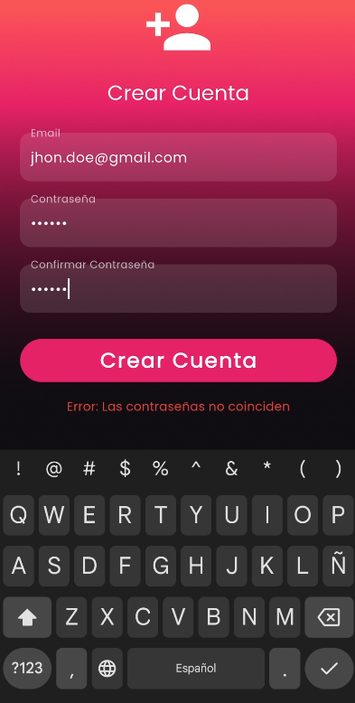
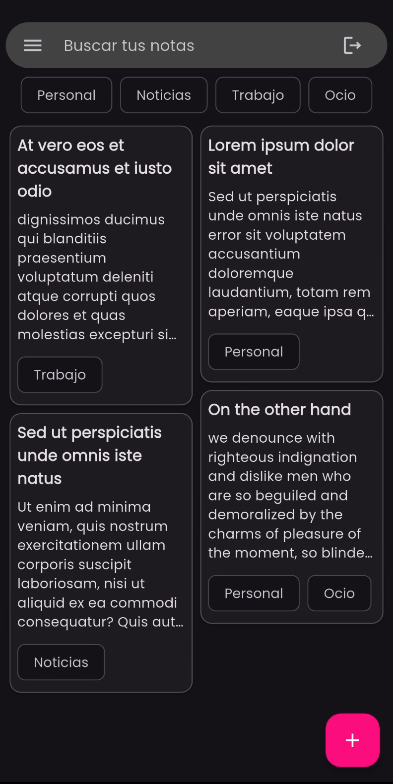
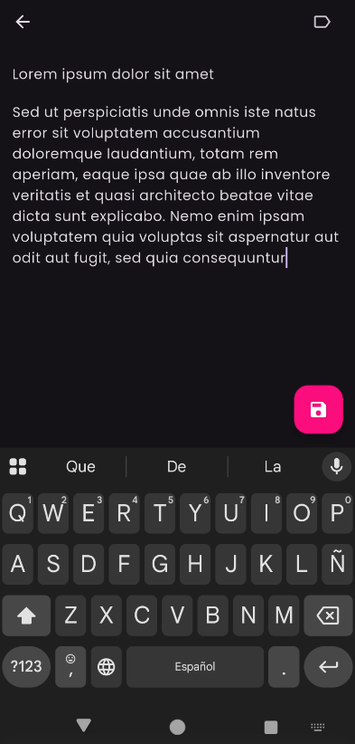
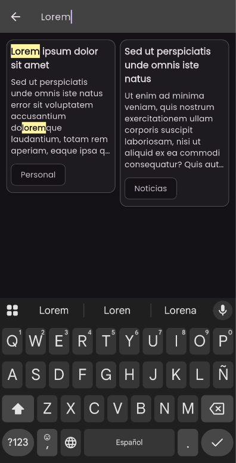
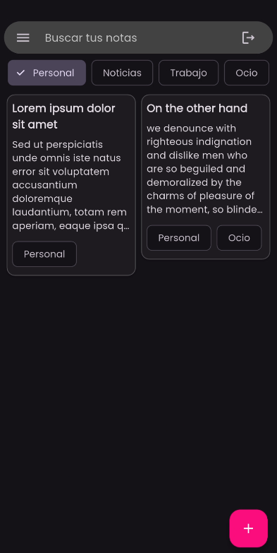
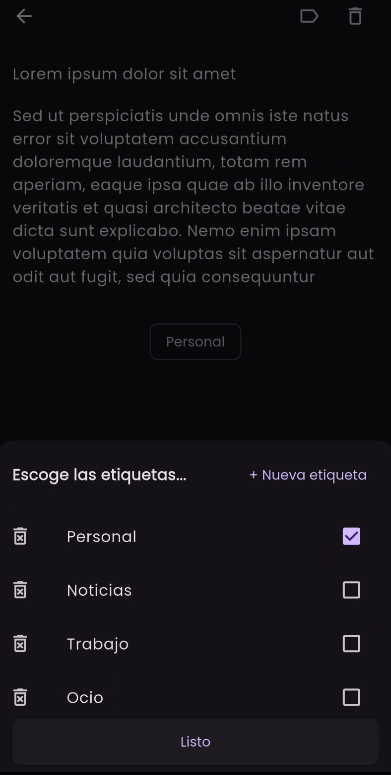

# Aplicación de Notas con Categorías y Firebase - Prueba Técnica

ImagiNotes una aplicación de notas desarrollada en Flutter como parte de una prueba técnica inspirada en la aplicación google Keep. La aplicación permite a los usuarios crear, editar y gestionar notas categorizadas, utilizando Firebase para autenticación y almacenamiento de datos.

## Funcionalidades

* **Autenticación**: Registro e inicio de sesión de usuarios mediante Firebase Authentication.
* **Gestión de Notas**: Crear, editar y eliminar notas.
* **Categorización**: Clasificar las notas por categorías.
* **Persistencia de Datos**: Almacenamiento y sincronización en tiempo real de notas con Firestore.
* **Búsqueda**: Función de búsqueda de notas.

## Requisitos para Ejecución

* Flutter 3.29.2 
* **Android**: Android SDK 35.0.0 y NDK 27.0.12077973
* **iOS**: iOS 16.4 y CocoaPods 1.16.2

## Configuración de Firebase

El proyecto fue configurado usando FlutterFire CLI, para reemplazar la configuración se deben agregar los datos en el archivo `firebase_options.dart`.

En el repo se encuentra un archivo `firebase_options.dart` que contiene los datos de acceso a Firebase de una cuenta de prueba 🙂.

En caso de usar otro proyecto de Firebase, es necesario activar la autenticación, Firestora y actualizar las politicas de seguridad de la aplicación.

## Capturas de Pantalla

Aquí se muestran algunas capturas de pantalla de la aplicación:

_La aplicación utiliza firebaseAuth para el proceso de autenticación_

_Al presionar el botón crear cuenta redirige a esta vista_

_Indica al usuario si se presentó algún error en el proceso de registro_

_Visualiza todas tus notas, tienes opción de filtrar por categoría, buscar texto dentro de las notas, editarlas y cerrar tu sesión_

_Crea una nueva nota al presionar el botón flotante en la vista de notas, agrega titulo, contenido y etiquetas_

_Permite realizar busquedas en todas las notas y resaltar el texto buscado_

_Visualiza las notas filtradas por categoría_

_Modifica las notas y las etiquetas asi como eliminar notas o etiquetas_

